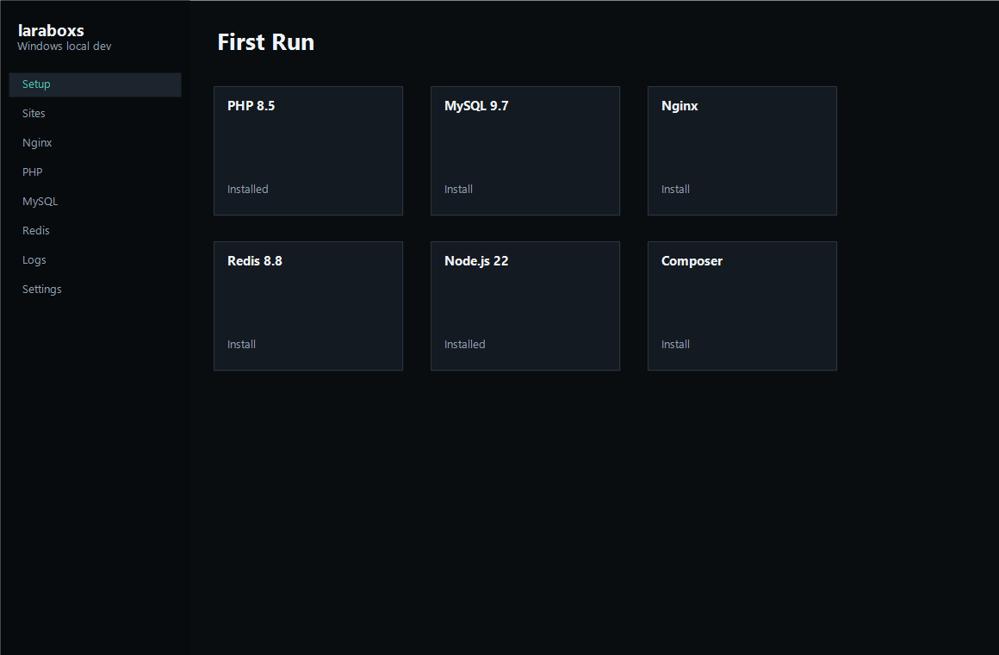
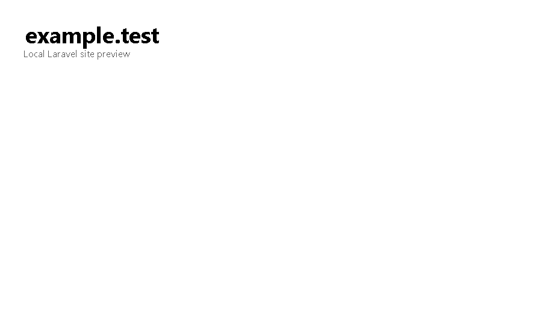

# laraboxs

[](LICENSE)
[](docs/usage.md)
[](package.json)

**laraboxs** is an open-source, Windows-first local development manager for PHP and Laravel projects. It combines a React dashboard, a localhost helper API, and a CLI so you can manage sites, Nginx, PHP, MySQL/MariaDB, Redis, phpMyAdmin, SSL certificates, logs, and runtimes from one workspace.

Repository: [github.com/bo3bdo/Hosrlaravel](https://github.com/bo3bdo/Hosrlaravel)

## Screenshots

Documentation images use generic example paths and domains (`example.test`, `C:\dev\www`, `%USERPROFILE%\.config\laraboxs`). They are illustrative placeholders for the public README.

| Site entry | Nginx | PHP |
| --- | --- | --- |
|  |  |  |

| First-run setup | Site preview |
| --- | --- |
|  |  |

## Features

- React dashboard for sites, services, tools, logs, settings, and first-run setup.
- TypeScript CLI exposed as `laraboxs` after a production build and `npm link`.
- Parked folder discovery for Laravel, PHP, and static projects.
- Nginx configuration generation with per-site entry and document-root paths.
- Global and per-site PHP version selection with FastCGI worker management.
- Generated `php.ini` settings and Laravel-friendly extension controls.
- MySQL 9.7, MySQL 8.4, MySQL 8.0, and MariaDB 11.8.6 runtime support.
- Database initialization, root password management, port selection, database creation, and Laravel `.env` output.
- Redis install and local start/stop/restart controls.
- App-local phpMyAdmin exposed at `phpmyadmin.test`.
- Local CA generation, per-site HTTPS certificates, and explicit Windows trust flow.
- Localhost-only helper API with trusted host/origin checks and optional helper token support.
- Tauri v2 desktop wrapper scaffold and Windows helper-service scripts.
- Vitest coverage for API security, CLI parsing, hosts merging, runtime installs, service logic, SSL, logs, and site detection.

## Requirements

- Windows 10 or newer.
- Node.js 22 or newer for development.
- npm 10 or newer.
- PowerShell 5.1 or newer.
- Administrator privileges for hosts file writes, service installation, and certificate trust prompts.
- Rust and Cargo only when running or packaging the Tauri desktop wrapper.

Runtime packages for PHP, MySQL/MariaDB, Nginx, Redis, Node.js, Composer, and phpMyAdmin are downloaded into the laraboxs app data directory when installed through the app or CLI.

## Quick Start

```powershell
git clone https://github.com/bo3bdo/Hosrlaravel.git
cd Hosrlaravel
npm install
npm run check
npm run api
npm run dev
```

Open `http://127.0.0.1:5173`.

For a built single-server run:

```powershell
npm run build
npm start
```

Open `http://127.0.0.1:47899`.

On first launch, choose a sites folder and database runtime. laraboxs can install the default PHP runtime, selected database runtime, Nginx, Composer, Node.js, and phpMyAdmin into `%USERPROFILE%\.config\laraboxs`.

## CLI Examples

```powershell
npm run build
npm link

laraboxs sites
laraboxs park C:\dev\www --dry-run-hosts
laraboxs site:entry example.test public
laraboxs use 8.5
laraboxs isolate 8.4 example.test
laraboxs secure example.test
laraboxs ssl:trust
laraboxs mysql:status
laraboxs mysql:init
laraboxs mysql:create-db example_app
laraboxs mysql:env example_app
laraboxs redis:start
laraboxs phpmyadmin:install --dry-run-hosts
laraboxs install php 8.5
laraboxs install mysql mariadb-11.8.6
laraboxs install redis
```

## Project Layout

```text
src/core      Shared domain logic for config, sites, runtimes, services, SSL, logs, and tools.
src/api       Localhost helper API used by the dashboard.
src/cli       Command-line interface.
src/ui        React dashboard.
src-tauri     Tauri v2 desktop wrapper scaffold.
scripts       Windows packaging, helper-service, and doc screenshot scripts.
tests         Vitest test suite.
docs          Usage, architecture, development notes, and screenshots.
```

## Development

```powershell
npm run typecheck
npm run test
npm run build
npm run check
npm run clean
```

Local development usually uses two processes:

```powershell
npm run api
npm run dev
```

The Vite dev server proxies `/api` calls to the helper API on `127.0.0.1:47899`. Production mode builds the dashboard into `dist-ui` and serves both the API and dashboard from the helper process.

Regenerate sanitized README screenshots after UI changes:

```powershell
powershell -ExecutionPolicy Bypass -File scripts/generate-docs-screenshots.ps1
```

Read [docs/development.md](docs/development.md) for contribution workflow, test strategy, architecture rules, and release preparation.

## Documentation

- [Usage Guide](docs/usage.md)
- [Architecture](docs/architecture.md)
- [Development Guide](docs/development.md)
- [Security Policy](SECURITY.md)
- [Contributing](CONTRIBUTING.md)

## Open Source

laraboxs is original open-source software under the [MIT License](LICENSE). Contributions are welcome through issues and pull requests. Please follow [CONTRIBUTING.md](CONTRIBUTING.md) and report security issues privately as described in [SECURITY.md](SECURITY.md).

Do not commit local secrets, `.env` files, runtime downloads, or personal screenshots. App data and passwords stay under `%USERPROFILE%\.config\laraboxs` on your machine.

## Current Status

The browser dashboard, helper API, CLI, runtime installer logic, and tests are the most mature surfaces. The Tauri wrapper is scaffolded and wired to the same dashboard, but production desktop packaging still needs continued native helper-service hardening and release signing work.

## License

Copyright (c) 2026 laraboxs contributors. Released under the [MIT License](LICENSE).
